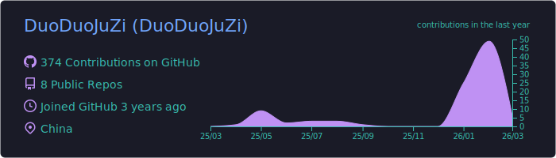
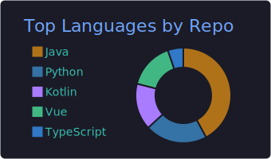

  

   

  <samp>
    "Talk is cheap. Show me the code."
  </samp>
  
    

  

    👋 <b>About Me:</b> A student passionate about connecting software with the physical world. 
    📍 <b>Location:</b> Shandong, China 🇨🇳 
    🗣️ <b>Languages:</b> Mandarin 🇨🇳 | English 🇺🇸 | Japanese 🇯🇵
  

  <h3>🚀 Weapons of Choice</h3>
  
  
<b>Languages & Frameworks</b>

  
  
   
  
  
<b>DevOps & Hardware</b>

  

 

  <h3>📈 Coding Stats (Includes Private Repos)</h3>
  
  
   
  

